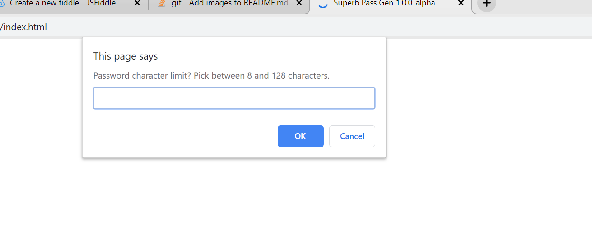
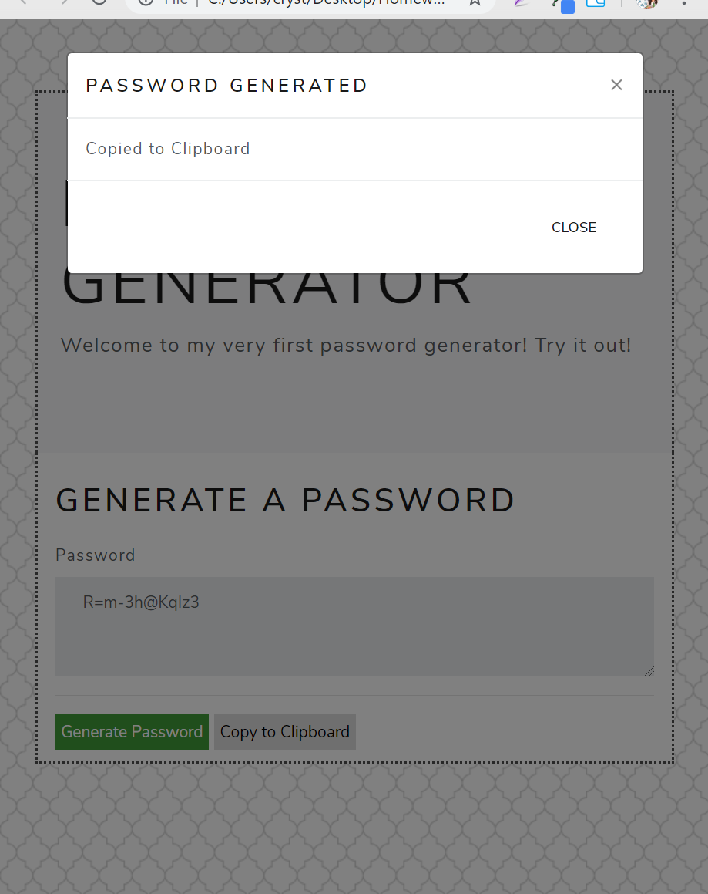

# Superb-Pass-Gen
Random password generator created with JavaScript! 
https://cml2377.github.io/Superb-Pass-Gen/

On page load, the browser prompts the user for number of characters, and type of characters that they want to include (numbers, special characters, lower-case, upper-case, etc.)

When the user inputs their requirements, the page will provide 2 buttons. The first one will generate a random password based on the user's input.

The second button will copy the password to the user's clipboard and display a modal that confirms the action.

